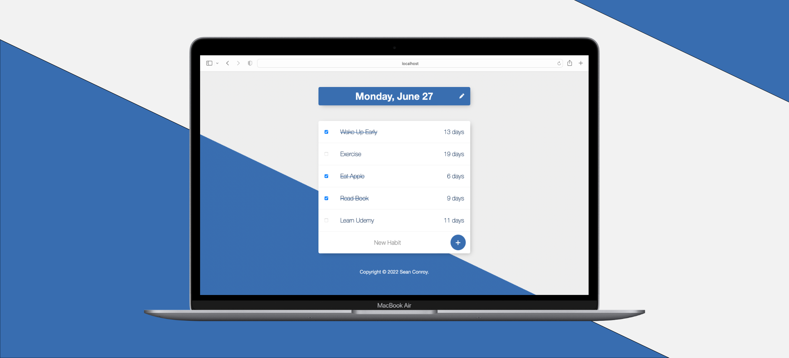

# Habit Tracker



Track your habits, keep your streaks. The objective of this project was to develop a Node.js application that could be run locally on someone's machine, allowing them to maintain a log of their daily habits and monitor how long they have been performing them continuously.

<div>
  <p>
    <a href="https://github.com/SeanConroy01/habit-tracker/issues">Report Bug</a>
    ·
    <a href="https://github.com/SeanConroy01/habit-tracker/issues">Request Feature</a>
    ·
    <a href="https://www.imseanconroy.co.uk/project-2">View Portfolio</a>
  </p>
</div>

## Table of Contents

- [Prerequisites](#prerequisites)
- [Getting Started](#getting-started)
- [Contributing](#contributing)
- [License](#license)
- [Support](#support)
- [Contact](#contact)
- [Acknowledgments](#acknowledgments)

## Prerequisites

This project requires Node.js and MongoDB. Install instructions can be found below:

- [Node.js 10+](http://nodejs.org)
- [MongoDB](https://www.mongodb.com/download-center/community)

**Note:** If you are new to Node.js or Express, you may find
[Learn Express JS In 35 Minutes](https://www.youtube.com/watch?v=SccSCuHhOw0)
helpful for learning the basics. Alternatively, here is an excellent Udemy course that I used to learn Node.js - [The Complete Node.js Developer Course (3rd Edition)](https://udemy.com/course/the-complete-nodejs-developer-course-2/).

## Getting Started

The easiest way to get a local copy up and running is to clone the repository:

1. Clone the repository
```
git clone https://github.com/SeanConroy01/habit-tracker.git
```
2. Change directory
```
cd habit-tracker
```
3. Install NPM packages
```
npm install
```
4. Create a .env file or export as environment variables
```
PORT=3000
MONGODB_URI=mongodb://127.0.0.1:27017/habit-tracker
```
5. Start the application
```
npm run start
```

The application can also be started with nodemon using `npm run dev`, if you want to add additional functionality. Linting can also be performed using `npm run lint` and a basic jest test suite can be run using `npm run test`.

## Contributing

If you have a suggestion that would make this better, please fork the repo and create a pull request. You can also simply open an issue with the tag "enhancement".
Don't forget to give the project a star! Thanks again!

1. Fork the Project
2. Create your Feature Branch (`git checkout -b feature/YourFeature`)
3. Commit your Changes (`git commit -m 'Add some YourFeature'`)
4. Push to the Branch (`git push origin feature/YourFeature`)
5. Open a Pull Request

## License

This project is distributed under the MIT License. See [LICENSE.md](LICENSE.md) for more details.

## Support

If you are having problems, please let us know by [raising a new issue](https://github.com/SeanConroy01/habit-tracker/issues/new/choose).

## Contact

Contributors names and contact info

Sean Conroy ([@ImSeanConroy](https://twitter.com/ImSeanConroy)) - [hello@imseanconroy.com](hello@imseanconroy.com)

## Acknowledgments

Use this space to list resources you find helpful and would like to give credit to. I've included a few of my favorites to kick things off!

* [Choose an Open Source License](https://choosealicense.com)
* [Font Awesome](https://fontawesome.com)
* [A Complete Guide to Dark Mode on the Web](https://css-tricks.com/a-complete-guide-to-dark-mode-on-the-web/)
* [Crontab Guru](https://crontab.guru)
* [Getting Started with ESLint](https://eslint.org/docs/user-guide/getting-started)

<p align="right">(<a href="#top">back to top</a>)</p>
